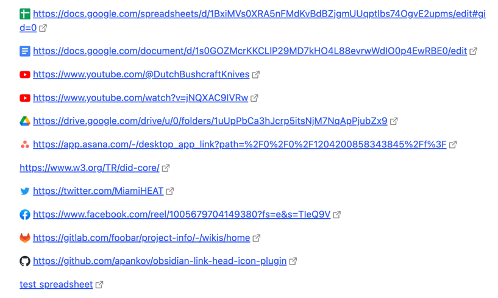

# Obsidian Link Head Icon

This Plugin shows little image in reading mode ahead of external links to some common websites. Such a behaviour is highly inspired by how Asana became to refer to external documents.

**Example**

## How to install

1. Go to **Community Plugins** in your [Obsidian](https://www.obsidian.md) Settings and **disable** Safe Mode
2. Click on **Browse** and search for „Link Head Icon“
3. Click install
4. Toggle the Plugin on in the **Community Plugins** Tab

# TODO

1. Support mobile app.
2. Show image icons in editing mode.
